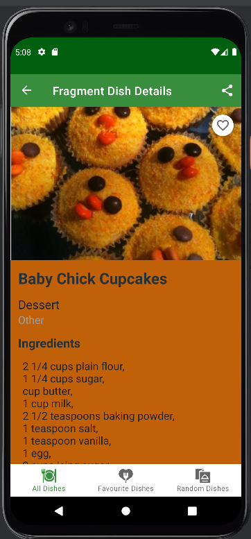

# MyDishes

* In this application you can add your dishes with recipes and photos.
* Confuse what to eat today no issue it has a random dish selector also.
* You can also add your fav dishes in second coloumn.

 

# Landing Page

* It is a splash screen which goes in an up to down manner with a green backgorund.

  

# All Dishes

* This is the list of all you dishes you made or select.
* at the right most corner you can filter them according to thier genre.
* Next to filter there is a add sign from there you can add new Dish.
* At the bottom there is a navigation panel to navigate you through All Dishes, Favourite Dishes and Random Dishes.

 

# Favourite Dishes

* This is the list of dishes you like the most and marked as favourite.
* You can click on the dish and can see a beautiful pallete matching the color of the screen.
* You can add dishes to your favourite dishes by simply clicking the heart icon and remove it also.

 

# Dish Details

* After clicking on a dish you see its details.
* It has this palette feature which make the color of the screen match the color of the dish.

# Random Dishes

* In this you can get a random Dish.
* You can search for dishes by refreshing the random Dish page.

